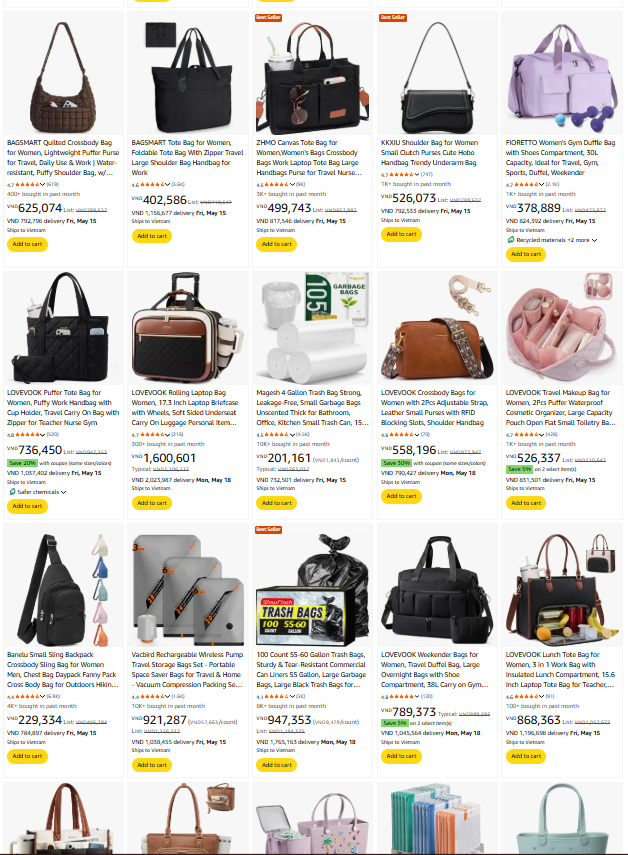
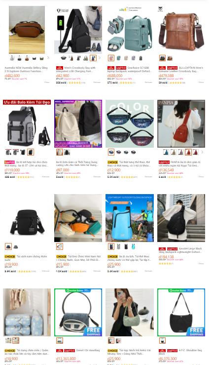
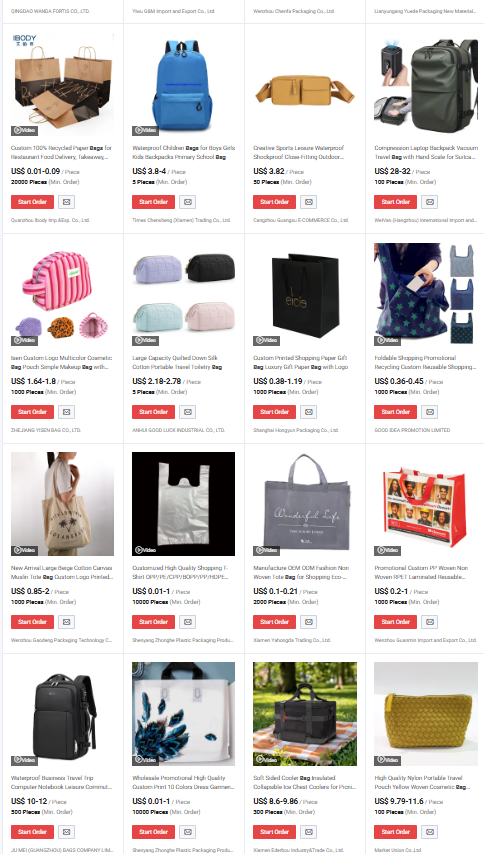
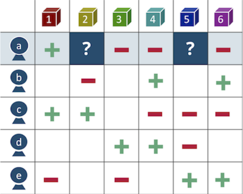
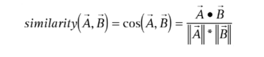
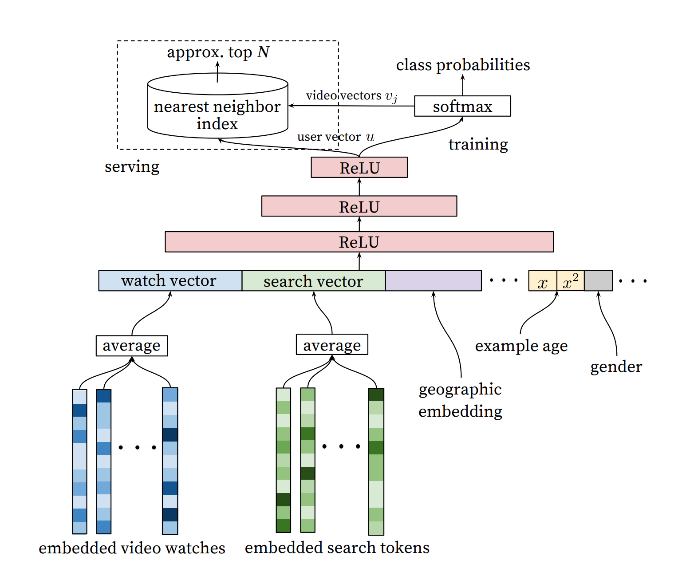
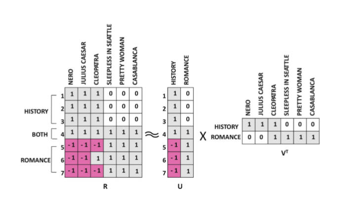

<!--
_backgroundImage: url("./images/bg1.jpg")
_paginate: false 
-->

<h2 class="mon-hoc">Đồ án môn học Toán Ứng dụng Thống kê </h2>

<h1 class="de-tai">ỨNG DỤNG ĐẠI SỐ TUYẾN TÍNH TRONG HỆ THỐNG GỢI Ý PHIM</h1>

Nhóm 15 - 24CTT1

---

### Giới thiệu thành viên

| Họ và tên | MSSV | Nhiệm vụ chính |
| :--- | :---: | :--- |
| **Nguyễn Ngọc Trâm Anh** | 24120019 | Kỹ thuật |
| **Nguyễn Hà Minh Hiền** | 24120046 | Slide |
| **Nguyễn Trọng Hiếu** | 24120050 | Báo cáo |
| **Lý Thảo Nguyên** | 24120105 | Báo cáo |
| **Mai Khắc Hoàng Vũ** | 24120183 | Kỹ thuật|

---
### Nội dung

1. **Đặt vấn đề:** Tại sao cần hệ thống gợi ý?
2. **Thực tế:** Các hệ thống gợi ý hiện nay (Netflix, Amazon, Youtube).
3. **Bài toán:** Xác định Input, Output và mô hình dữ liệu.
4. **Ứng dụng Đại số tuyến tính:** Vai trò của Đại số tuyến tính trong bài toán.
5. **Kỹ thuật thực hiện:** Quy trình cài đặt thuật toán và đánh giá.
6. **Phần kết**: Kết luận và hướng phát triển

---

<h1 class="header-title">1) Đặt vấn đề</h1>

    

        <h2>Sự bùng nổ lựa chọn</h2>
        
(Choice Explosion)

    

→

        <h2>Quá tải thông tin</h2>
        
(Information Overload)

    <blockquote>
        Người dùng ngày càng khó khăn trong việc tìm ra nội dung/ sản phẩm thực sự phù hợp với nhu cầu của họ.
    </blockquote>

---

<h1 class="header-title"></h1>

 

### 10,000 kết quả - "bag"
*(Hình 1: Amazon.com)*

---

<h1 class="header-title"></h1>

 

### 4,794 kết quả - "bag"
*(Hình 2: Lazada.com)*

---

<h1 class="header-title"></h1>

 

### 484,449 kết quả - "bag"
*(Hình 3: taobao.com)*

---

## 💡 Giải pháp
**Hệ thống gợi ý** 
- Không hiển thị tất cả
- Chỉ hiển thị lựa chọn người dùng quan tâm
- Hệ thống thu thập "Ma trận đánh giá" (User-Item Matrix) - Ma trận thưa

## ⚠️ Thách thức

(Hình 4: Dựa trên những dữ liệu đã có -->  dự đoán các ô chưa có.)

---

<h1 class="header-title">2) Thực tế</h1>

<ul class="intro-text">
    <li><strong>Đại số tuyến tính</strong> là ngôn ngữ nền tảng của hệ thống gợi ý.</li>
</ul>

    

    

            
            (Hình 5: Công thức Cosine Similarity)
        

        
<b>Amazon:</b> Tiên phong dùng <i>Cosine Similarity</i> để tính sự tương đồng giữa các sản phẩm từ đó tìm ra các sản phẩm "mua cùng nhau".
         
         
        <b>Bài báo:</b> Amazon.com Recommendations: Item-to-Item Collaborative Filtering" - Greg Linden
        

    

    

    

            
            (Hình 6: Kiến trúc Neural Network của YouTube)
        

        
<b>YouTube:</b> Sử dụng lớp <i>Softmax</i> để nhân vector người dùng <b>U</b> với ma trận video <b>V</b>, dự đoán hành vi xem tiếp theo.

    

---

 

<figcaption>(Hình 7: BellKor's Pragmatic Chaos tại Netflix Prize năm 2009)</figcaption>

Áp dụng <strong>phân rã ma trận</strong> bằng kỹ thuật <strong>SVD</strong> chính là thuật toán đã giúp đội <strong>BellKor's Pragmatic Chaos</strong> giành chiến thắng <strong>Netflix Prize</strong> năm 2009 trị giá 1 triệu USD. Thuật toán này đã cải thiện độ chính xác của hệ thống gợi ý Netflix lên hơn 10% và trở thành <strong>kiến trúc nền tảng</strong> cho ngành công nghiệp Hệ thống gợi ý hiện đại.

---

<h1>Hôm nay xem gì?</h1>

---

<h1 class="header-title">3) Bài toán, Input, Output </h1>

- **Bài toán:** Sử dụng SVD để phân rã ma trận tương tác **R** thành hai ma trận thành phần **U** và **V**.

**🎯 Mục đích:**
- **Tiết kiệm bộ nhớ** 
- **Xử lý đặc trưng tốt hơn** 

*(Hình 8: Minh họa phân rã ma trận R thành U và V)*

---

<h1 class="header-title">Quy trình: Training, Input & Output</h1>

<h2>📥 Training</h2>
        <ul>
            <li><b>UserID</b></li>
            <li><b>MovieID</b></li>
            <li><b>Rating</b>: Đánh giá thực tế</li>
        </ul>
        
Dữ liệu lịch sử dùng để học các Latent Factors

    

        <h2>📥 Input</h2>
        <ul>
            <li><b>UserID</b></li>
            <li><b>MovieID</b>: Tập hợp các phim mà người dùng chưa tương tác.</li>
        </ul>
        
Yêu cầu dự đoán dựa trên model đã học

    

        <h2>📤 Output</h2>
        <ul>
            <li><b>Điểm dự đoán</b>: 1.0 - 5.0 cho từng phim.</li>
            <li><b>Top-n items</b>: Danh sách phim sắp xếp giảm dần theo điểm.</li>
        </ul>
        
Kết quả mang tính cá nhân hóa

    

---

<h1 class="header-title">4) Ứng dụng đại số tuyến tính</h1>

        <h2>SVD</h2>
        
SVD (Lý thuyết) 

        

$$R = U \cdot \Sigma \cdot V^T$$

        <ul>
            <li class="warning">Chỉ chạy trên ma trận đầy đủ (không có ô trống).</li>
            <li>Không thể tính toán trực tiếp nếu thiếu dữ liệu.</li>
        </ul>
    

        <h2>SGD</h2>
        
SGD (Thực thi)

        

$$R \approx U \cdot V^T$$

        <ul>
            <li class="highlight">Làm việc trực tiếp với các ô có dữ liệu.</li>
            <li>Sử dụng đạo hàm và sai số để điều chỉnh U và V.</li>
            <li>Tối ưu hóa dần dần để dự đoán các ô còn trống.</li>
        </ul>
    

---

<h1 class="header-title">Dự đoán bằng Nhân vô hướng (Dot Product)</h1>

    

        

            <b>👤 User A (Sở thích):</b> 
            Rất thích Hành động, ghét Lãng mạn
            

$\vec{u} = \begin{bmatrix} 0.9 & 0.1 \end{bmatrix}$

        

            <b>🎬 Phim "Die Hard":</b> 
            Nhiều cháy nổ, ít tình cảm
            

$\vec{i} = \begin{bmatrix} 0.8 & 0.2 \end{bmatrix}$

        

    

$$\text{Score} = \vec{u} \cdot \vec{i} = (0.9 \times 0.8) + (0.1 \times 0.2) = 0.74$$

        <b>Kết luận:</b> Con số <b>0.74 (74%)</b> đủ cao để nhận diện sự tương quan lớn.
         
        <b>Hành động:</b> Đẩy phim <i>"Die Hard"</i> lên trang chủ cho A
    

* Ngược lại: Với "Titanic" $\vec{i}_{t} = \begin{bmatrix} 0.1 & 0.9 \end{bmatrix} \implies \text{Score} = 0.18$ (Không gợi ý).

---

<h1 class="header-title">5) Kỹ thuật thực hiện </h1>

        
1

        

            <h3>Chuẩn bị dữ liệu (Dataset)</h3>
            
Sử dụng tập dữ liệu <b>MovieLens</b> đã làm sạch từ thư viện Cornac.

            <code>cornac.datasets.movielens.load_feedback()</code>
        

    

        
2

        

            <h3>Huấn luyện mô hình (Training)</h3>
            
Khởi tạo <code>cornac.models.SVD(k=50)</code> và gọi hàm <code>.fit()</code>.

            
Thuật toán tự động tìm ra các ma trận cốt lõi thông qua tối ưu hóa.

        

    

        
3

        

            <h3>Toán học và thực nghiệm</h3>
            
Trích xuất ma trận <code>U</code> (user_factors) và <code>V</code> (item_factors).

            
Tính toán thủ công bằng Numpy: <code>numpy.dot(U[i], V[j])</code>

            

                🎯 In kết quả ra màn hình để chứng minh việc dùng trực tiếp dùng toán học để sinh ra kết quả gợi ý
            

        

    

---

<h1 class="header-title">6) Kết luận & Hướng phát triển</h1>

        <h2>📌 Kết luận</h2>
        <ul>
            <li><b>Đại số tuyến tính</b> là "xương sống" giúp máy tính hiểu được sở thích con người thông qua các con số.</li>
            <li><b>Phân rã ma trận (SVD/SGD)</b> giải quyết triệt để bài toán dữ liệu thưa và gợi ý phim.</li>
            <li>Độ chính xác cao, khả năng mở rộng tốt cho hệ thống thực tế.</li>
        </ul>
    

        <h2>📌 Hướng phát triển</h2>
        <ul>
            <li><b>Hybrid System:</b> Kết hợp với lọc dựa trên nội dung <b>(Content-based)</b> hoặc lọc Cộng tác <b>(Collaborative Filtering)</b> để giải quyết "Cold Start".</li>
            <li><b>Deep Learning:</b> Ứng dụng <b> Neural Networks</b> (như NCF) để học các đặc trưng phi tuyến tính phức tạp hơn.</li>
            <li><b>Real-time:</b> Tối ưu hóa tốc độ tính toán để gợi ý ngay lập tức theo hành vi thực tế.</li>
        </ul>
    

---

<h1 class="header-title">Tài liệu tham khảo (References)</h1>

        <b>[1] Matrix Factorization Techniques for Recommender Systems</b>
        
Yehuda Koren, Robert Bell, Chris Volinsky. IEEE Computer Society, 2009.

    

        <b>[2] Cornac: A Comparative Framework for Multimodal Recommender Systems</b>
        
Preferred.AI. GitHub Repository & Documentation.

        
https://github.com/PreferredAI/cornac

    

        <b>[3] MovieLens Dataset</b>
        
F. Maxwell Harper and Joseph A. Konstan. ACM Transactions on Interactive Intelligent Systems.

        
https://grouplens.org/datasets/movielens/

    

        <b>[4] Amazon.com Recommendations</b>
        
Amazon.com Recommendations: Item-to-Item Collaborative Filtering

        
https://github.com/wzhe06/Reco-papers/blob/master/Classic%20Recommender%20System/%5BCF%5D%20Amazon%20Recommendations%20Item-to-Item%20Collaborative%20Filtering%20%28Amazon%202003%29.pdf

    

---

# CẢM ƠN ĐÃ LẮNG NGHE!
## Q&A - Giải đáp thắc mắc

    📧 group15@student.hcmus.edu.vn | 💻 github.com/group-15

    Bài thuyết trình về Ứng dụng ĐSTT trong hệ thống gợi ý phim

